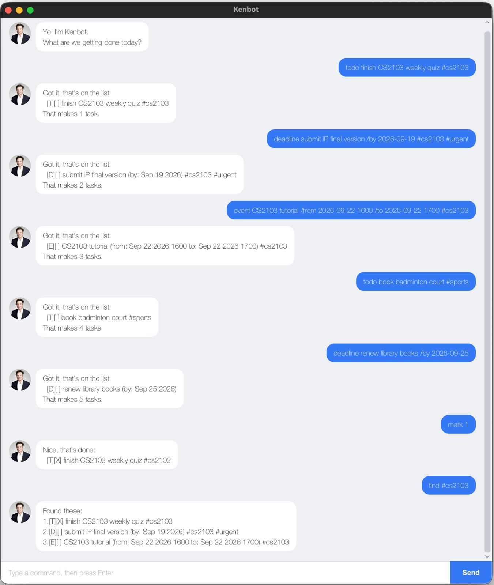

# Kenbot User Guide

Kenbot is a chatbot for keeping track of things you need to do. You type a
command, it answers, and it remembers everything between runs by saving your
tasks to a file.

It opens as a window, and the same commands also work in a terminal if you
prefer one.



## Getting started

1. Make sure you have **Java 25** installed.
2. Download `kenbot.jar`, or build it yourself with `./gradlew shadowJar`.
3. Double-click the file, or run it from a terminal:

   ```
   java -jar kenbot.jar
   ```

4. A window opens. Type a command, press Enter, and Kenbot replies.

Kenbot keeps your tasks in `data/Kenbot.txt`, created next to wherever you start
it. You never need to make that folder yourself.

### Using the window

* **Send a message** either by pressing Enter or by clicking **Send**. Both do
  the same thing.
* **Your messages appear on the right** in blue, and Kenbot's replies on the
  left in white beside its picture. The two sides look different on purpose:
  your side is an echo of what you typed, Kenbot's is the part worth reading.
* **The conversation scrolls itself**, so the newest message is always the one
  you can see.
* **Mistakes are answered, not crashes.** If a command cannot be carried out,
  Kenbot replies with what went wrong and waits for the next one. A refusal is
  shown in red with an outline, so you can tell at a glance whether a command
  worked without having to read the reply.
* **Resize the window to suit you.** The conversation grows with it, so a wider
  window shows more of each message rather than more empty space.

### Running it in a terminal instead

Every command below works identically without the window:

```
java -cp kenbot.jar kenbot.Kenbot
```

Both modes read and write the same `data/Kenbot.txt`, so you can switch between
them freely and your tasks follow you.

## Commands at a glance

| Command | What it does |
| --- | --- |
| `todo DESCRIPTION` | adds a task with no date |
| `deadline DESCRIPTION /by DATE` | adds a task due by a date |
| `event DESCRIPTION /from DATE /to DATE` | adds a task spanning two dates |
| `list` | shows every task, numbered |
| `mark NUMBER` | marks a task done |
| `unmark NUMBER` | marks a task not done |
| `delete NUMBER` | removes a task |
| `find KEYWORD` | shows tasks whose description contains the keyword |
| `find #TAG` | shows tasks carrying that tag |
| `tag NUMBER TAG...` | adds one or more tags to a task |
| `untag NUMBER TAG...` | removes one or more tags from a task |
| `bye` | exits |

Any of the three commands that add a task also accepts tags at the end of the
line, so `todo read book #fun` works without a separate `tag` command.

## How to write dates

Dates go in as `yyyy-mm-dd`, and you may add a time after a space:

```
2019-10-15
2019-10-15 1800
```

Kenbot shows them back in a friendlier form — `Oct 15 2019` and
`Oct 15 2019 1800`.

Anything that is not a real date is refused, so `Sunday` and `15-10-2019` will
both be rejected with a reminder of the accepted format.

## About the examples below

The replies below are shown as the terminal prints them, between two lines of
underscores. In the window you see exactly the same wording inside a message
from Kenbot; the underscore lines are the terminal's way of separating one reply
from the next, and are not part of the answer.

## Adding a to-do

A task with nothing but a description.

Example: `todo read book`

```
____________________________________________________________
Got it. I've added this task:
  [T][ ] read book
Now you have 1 tasks in the list.
____________________________________________________________
```

## Adding a deadline

A task that has to be finished by a particular date.

Example: `deadline return book /by 2019-10-15`

```
____________________________________________________________
Got it. I've added this task:
  [D][ ] return book (by: Oct 15 2019)
Now you have 2 tasks in the list.
____________________________________________________________
```

## Adding an event

A task that runs from one date to another. Times are optional on either end.

Example: `event project meeting /from 2019-10-15 1400 /to 2019-10-15 1600`

```
____________________________________________________________
Got it. I've added this task:
  [E][ ] project meeting (from: Oct 15 2019 1400 to: Oct 15 2019 1600)
Now you have 3 tasks in the list.
____________________________________________________________
```

## Listing your tasks

Example: `list`

```
____________________________________________________________
Here are the tasks in your list:
1.[T][ ] read book
2.[D][ ] return book (by: Oct 15 2019)
3.[E][ ] project meeting (from: Oct 15 2019 1400 to: Oct 15 2019 1600)
____________________________________________________________
```

The letter in the first brackets is the kind of task — `T` for to-do, `D` for
deadline, `E` for event. The second brackets hold an `X` once the task is done.

An empty list says so rather than showing nothing:

```
____________________________________________________________
You have no tasks yet.
____________________________________________________________
```

## Marking a task done, or not done

Use the number shown by `list`.

Example: `mark 1`

```
____________________________________________________________
Nice! I've marked this task as done:
  [T][X] read book
____________________________________________________________
```

Example: `unmark 1`

```
____________________________________________________________
OK, I've marked this task as not done yet:
  [T][ ] read book
____________________________________________________________
```

## Deleting a task

Example: `delete 2`

```
____________________________________________________________
Noted. I've removed this task:
  [D][ ] return book (by: Oct 15 2019)
Now you have 2 tasks in the list.
____________________________________________________________
```

The remaining tasks are renumbered straight away, so `list` always runs from 1
with no gaps.

## Tagging a task

A tag is a short label such as `#fun` or `#cs2103`. A task can carry any number
of them, and they are shown at the end of its line.

The quickest way is to put them at the end when you create the task:

Example: `todo read book #fun #cs2103`

```
____________________________________________________________
Got it. I've added this task:
  [T][ ] read book #fun #cs2103
Now you have 1 tasks in the list.
____________________________________________________________
```

This works for deadlines and events too — put the tags after the dates:
`deadline return book /by 2019-10-15 #urgent`.

Only `#` words at the **end** of the line become tags. A `#` with ordinary words
after it stays in the description, so `todo read #1 book` gives you a task
described as "read #1 book" with no tags.

To tag a task you have already added, use `tag` with its number. The `#` is
optional here, and you can give several at once:

Example: `tag 1 fun cs2103`

```
____________________________________________________________
Tagged it:
  [T][ ] read book #fun #cs2103
____________________________________________________________
```

`untag` takes them back off again:

Example: `untag 1 fun`

```
____________________________________________________________
Removed that:
  [T][ ] read book #cs2103
____________________________________________________________
```

A tag is one word with no spaces, and cannot contain `|`. Capitals count:
`#Fun` and `#fun` are two different tags.

## Finding tasks

Searches the descriptions. Upper and lower case are ignored, and part of a word
counts — `find book` also finds "bookshop".

Start the keyword with `#` to search **tags** instead: `find #cs` finds anything
tagged `#cs2103`. The `#` is what chooses which one is searched, so `find fun`
will not find a task tagged `#fun` — you need `find #fun`.

Example: `find book`

```
____________________________________________________________
Here are the matching tasks in your list:
1.[T][X] read book
2.[D][ ] return book (by: Oct 15 2019)
____________________________________________________________
```

If nothing matches, Kenbot says so:

```
____________________________________________________________
No tasks match 'xyz'.
____________________________________________________________
```

## Leaving

Example: `bye`

```
____________________________________________________________
Peace! See you soon!
____________________________________________________________
```

In a terminal this ends the program. In the window it is only a goodbye — close
the window itself when you are finished.

Either way your tasks are already saved: every command writes the file
immediately, so nothing is lost even if you close Kenbot without typing `bye`.

## Things worth knowing

* **Commands are lower case.** `Todo` and `MARK` are not recognised.
* **Descriptions cannot contain `|`.** Kenbot uses that character to separate
  fields in its save file, so a task containing one is refused when you type it.
* **The numbers `find` shows start from 1** and are not the numbers to use with
  `mark` or `delete`. Run `list` first if you need the real number.
* **Tags are optional everywhere.** A task without any is stored and shown
  exactly as it was before tags existed, so a save file from an older Kenbot
  still opens and nothing needs converting.
* **A damaged save file does not lose everything.** If Kenbot cannot understand
  some lines, it loads the ones it can and tells you how many it skipped. In a
  terminal it says so as it starts; the window leaves the count in the terminal
  it was launched from.
* **The window can be resized**, down to 417 by 220 pixels and up to whatever
  your screen allows.
* **Long descriptions wrap** onto as many lines as they need, so nothing is cut
  off.
